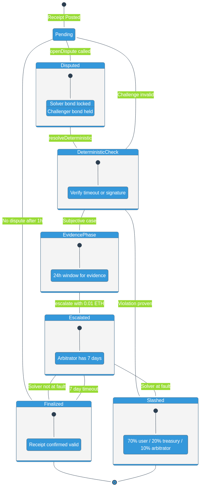

# Dispute Resolution



---

## Overview

The dispute resolution system is designed to handle both deterministic (on-chain verifiable) and subjective (requiring human judgment) disputes. The protocol prioritizes automated resolution where possible, only escalating to human arbitration when necessary.

Key design principles:

- **Deterministic First**: Timeout and signature disputes resolve automatically
- **Evidence-Based**: Both parties can submit evidence during a 24-hour window
- **Time-Bounded**: All disputes have maximum resolution timeframes
- **Economic Incentives**: Challenger bonds prevent frivolous disputes

---

## Receipt States

| State | Description | Next States |
|-------|-------------|-------------|
| **Pending** | In challenge window | Finalized, Disputed |
| **Disputed** | Under active dispute | Slashed, Pending, EvidencePhase |
| **Finalized** | Successfully settled | Terminal |
| **Slashed** | Violation confirmed | Terminal |

---

## Dispute Reasons

The protocol defines specific violation categories:

```solidity
enum DisputeReason {
    None,              // 0x00 - No dispute
    Timeout,           // 0x01 - Expiry without settlement
    MinOutViolation,   // 0x02 - amountOut < minOut
    WrongToken,        // 0x03 - Incorrect token
    WrongChain,        // 0x04 - Wrong chain
    WrongRecipient,    // 0x05 - Wrong address
    ReceiptMismatch,   // 0x06 - Receipt hash mismatch
    InvalidSignature,  // 0x07 - Bad signature
    Subjective         // 0x08 - Requires arbitration
}
```

---

## Deterministic Resolution

Two dispute types can be resolved entirely on-chain:

### Timeout Disputes

```solidity
if (dispute.reason == Types.DisputeReason.Timeout) {
    // Check if receipt expired without settlement proof
    if (block.timestamp > receipt.expiry &&
        _settlementProofs[receiptId] == bytes32(0)) {
        shouldSlash = true;
    }
}
```

### Invalid Signature Disputes

```solidity
if (dispute.reason == Types.DisputeReason.InvalidSignature) {
    bytes32 ethSignedHash = messageHash.toEthSignedMessageHash();
    address signer = ethSignedHash.recover(receipt.solverSig);
    if (signer != solver.operator) {
        shouldSlash = true;
    }
}
```

---

## Subjective Dispute Flow

For disputes requiring human judgment (MinOutViolation, WrongToken, etc.):

### Step 1: Evidence Phase (24 hours)

Both parties can submit evidence:

```solidity
function submitEvidence(
    bytes32 disputeId,
    bytes32 evidenceHash
) external;
```

Evidence is stored with timestamps:

```solidity
struct Evidence {
    bytes32 hash;        // IPFS/Arweave CID
    address submitter;   // Who submitted
    uint64 timestamp;    // When submitted
}
```

### Step 2: Escalation

Either party can escalate to arbitration:

```solidity
function escalate(bytes32 disputeId) external payable;
```

Requirements:
- Dispute must be `Subjective` type
- Arbitration fee: 0.01 ETH
- Dispute not already escalated

### Step 3: Arbitration Resolution

The arbitrator reviews evidence and issues a ruling:

```solidity
function resolve(
    bytes32 disputeId,
    bool solverFault,
    uint8 slashPercentage,
    string calldata reason
) external onlyArbitrator;
```

---

## Slashing Distribution

### Standard Resolution (IntentReceiptHub)

| Recipient | Percentage | Code |
|-----------|------------|------|
| User | 80% | `SLASH_USER_BPS = 8000` |
| Challenger | 15% | `SLASH_CHALLENGER_BPS = 1500` |
| Treasury | 5% | `SLASH_TREASURY_BPS = 500` |

### Arbitration Resolution (DisputeModule)

| Recipient | Percentage | Purpose |
|-----------|------------|---------|
| User | 70% | Compensation |
| Treasury | 20% | Protocol fund |
| Arbitrator | 10% | Resolution reward |

---

## Timeout Protection

If the arbitrator fails to act within 7 days:

```solidity
function resolveByTimeout(bytes32 disputeId) external {
    require(block.timestamp >= escalatedAt + ARBITRATION_TIMEOUT);

    // Default resolution: solver NOT at fault
    solverRegistry.unlockBond(dispute.solverId, solver.lockedBalance);

    // Refund arbitration fee to escalator
    _refundArbitrationFee(disputeId);

    // Update receipt status
    receiptHub.resolveEscalatedDispute(dispute.receiptId, false);
}
```

This ensures disputes cannot be held indefinitely.

---

## Optimistic Dispute Resolution (V2)

The `OptimisticDisputeModule` provides an alternative dispute mechanism with counter-bond economics:

### Counter-Bond Window

When a challenger opens a dispute, the solver has a **24-hour counter-bond window** to respond:

```
Dispute Opened → [24h Counter-Bond Window] → Resolution
                         │
                         ├─ Solver posts counter-bond → Escalate to arbitration
                         │
                         └─ No counter-bond → Challenger wins by timeout
```

### Flow

1. **Challenger opens dispute** with bond (10% of solver's stake)
2. **Counter-bond window opens** (24 hours)
3. **Solver decision**:
   - **Post counter-bond** → Dispute escalates to arbitration
   - **No response** → Challenger wins automatically (timeout resolution)
4. **Arbitration** (if counter-bond posted):
   - Arbitrator reviews evidence
   - Loser forfeits their bond

### Why Counter-Bonds?

| Benefit | Description |
|---------|-------------|
| **Filters frivolous disputes** | Solvers only fight disputes they believe they'll win |
| **Fast resolution** | Obvious violations resolve in 24h without arbitration |
| **Economic alignment** | Both parties have skin in the game |
| **Reduces arbitrator load** | Most disputes never reach arbitration |

### Counter-Bond Constants

```solidity
uint64 constant COUNTER_BOND_WINDOW = 24 hours;
uint16 constant COUNTER_BOND_BPS = 1000;  // 10% of locked bond
```

### Timeout Resolution

If solver doesn't post counter-bond:

```solidity
function resolveByTimeout(bytes32 disputeId) external {
    require(block.timestamp >= dispute.openedAt + COUNTER_BOND_WINDOW);
    require(!dispute.counterBondPosted);

    // Challenger wins - solver bond slashed
    _slashSolver(dispute.solverId, dispute.amount);

    // Return challenger bond
    _returnChallengerBond(disputeId);
}
```

---

## Key Constants

```solidity
// IntentReceiptHub
uint64 constant DEFAULT_CHALLENGE_WINDOW = 1 hours;
uint16 constant CHALLENGER_BOND_BPS = 1000;  // 10%

// DisputeModule
uint64 constant EVIDENCE_WINDOW = 24 hours;
uint64 constant ARBITRATION_TIMEOUT = 7 days;
uint256 constant DEFAULT_ARBITRATION_FEE = 0.01 ether;
```

---

## Example Scenario

**Subjective Dispute Timeline:**

```
Day 1, 10:00  Receipt posted
Day 1, 10:30  User opens dispute (Subjective - partial fill)
              Challenger bond: 0.01 ETH
              Solver bond locked: 0.1 ETH

Day 1, 10:35  Evidence window begins (24 hours)
Day 1, 11:00  Solver submits transaction proof (evidenceHash)
Day 1, 14:00  User submits screenshot of expected amount

Day 2, 10:35  Evidence window closes
Day 2, 12:00  User escalates with 0.01 ETH fee

Day 2-9       Arbitrator reviews evidence
Day 5, 15:00  Arbitrator rules: solverFault=true, 50% slash

              Result:
              - Solver loses 0.05 ETH (50% of bond)
              - User receives 0.035 ETH (70%)
              - Treasury receives 0.01 ETH (20%)
              - Arbitrator receives 0.005 ETH (10%)
              - User gets arbitration fee refunded
```

---

## Review Questions

1. Which dispute reasons can be resolved deterministically on-chain?

2. How long is the evidence submission window?

3. What happens if the arbitrator fails to resolve within 7 days?

4. How much must be paid to escalate a dispute to arbitration?

5. What is the slashing distribution during arbitration resolution?

---

*IRSB Protocol - Fair dispute resolution with deterministic guarantees*
