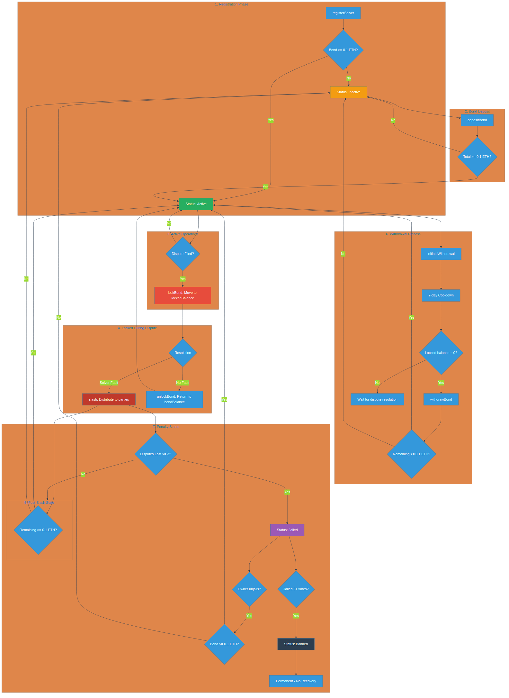

# Bond Lifecycle



---

## Overview

The bond system is the economic backbone of the IRSB Protocol. It ensures solvers have skin in the game - collateral that can be slashed if they violate intent constraints. This creates strong incentives for honest behavior.

Key properties of the bond system:

- **Minimum Threshold**: 0.1 ETH required for solver activation
- **Slashable Collateral**: Can be taken for violations
- **Withdrawal Cooldown**: 7-day delay prevents slash-and-run
- **Jail System**: Progressive penalties for repeat offenders

---

## Solver States

| State | Description | Can Post Receipts? | Can Withdraw? |
|-------|-------------|-------------------|---------------|
| **Inactive** | Registered, bond < 0.1 ETH | No | Yes |
| **Active** | Bonded >= 0.1 ETH | Yes | Yes (with cooldown) |
| **Jailed** | Temporarily suspended | No | No |
| **Banned** | Permanently blocked | No | Yes (remaining balance) |

---

## Phase 1: Registration

New solvers register and deposit initial bond:

```solidity
// Register as a solver
function registerSolver(
    string calldata metadataURI,
    address operator
) external returns (bytes32 solverId);

// Deposit bond (can be called multiple times)
function depositBond(bytes32 solverId) external payable;
```

**Activation Logic:**

```solidity
// Auto-activate when minimum bond met
if (solver.status == Types.SolverStatus.Inactive &&
    solver.bondBalance >= MINIMUM_BOND) {
    solver.status = Types.SolverStatus.Active;
}
```

---

## Phase 2: Active Operations

While active, solvers can post receipts and earn reputation:

```solidity
// SolverRegistry tracks two balances
struct Solver {
    uint256 bondBalance;    // Available for use
    uint256 lockedBalance;  // Locked during disputes
}
```

**Bond Locking During Disputes:**

When a dispute is opened, the solver's bond is locked:

```solidity
function lockBond(bytes32 solverId, uint256 amount) external onlyAuthorized {
    Types.Solver storage solver = _solvers[solverId];
    require(solver.bondBalance >= amount, "Insufficient bond");

    solver.bondBalance -= amount;
    solver.lockedBalance += amount;
}
```

---

## Phase 3: Dispute Resolution

### If Solver at Fault (Slashing)

```solidity
function slash(
    bytes32 solverId,
    uint256 amount,
    bytes32 receiptId,
    Types.DisputeReason reason,
    address recipient
) external onlyAuthorized {
    // Slash from locked first, then available
    if (solver.lockedBalance >= amount) {
        solver.lockedBalance -= amount;
    } else {
        uint256 fromLocked = solver.lockedBalance;
        solver.lockedBalance = 0;
        solver.bondBalance -= (amount - fromLocked);
    }

    // Update reputation
    solver.score.disputesLost++;
    solver.score.totalSlashed += amount;

    // Transfer to recipient
    payable(recipient).call{value: amount}("");
}
```

### If Solver Not at Fault

```solidity
function unlockBond(bytes32 solverId, uint256 amount) external onlyAuthorized {
    solver.lockedBalance -= amount;
    solver.bondBalance += amount;
}
```

---

## Phase 4: Withdrawal

Solvers can withdraw bonds with a 7-day cooldown:

```solidity
// Step 1: Initiate withdrawal
function initiateWithdrawal(bytes32 solverId) external {
    require(solver.lockedBalance == 0, "Bond locked");
    _withdrawalRequest[solverId] = uint64(block.timestamp);
}

// Step 2: After 7 days, execute withdrawal
function withdrawBond(bytes32 solverId, uint256 amount) external {
    require(block.timestamp >= requestTime + WITHDRAWAL_COOLDOWN);

    solver.bondBalance -= amount;
    payable(solver.operator).call{value: amount}("");

    // Auto-deactivate if below minimum
    if (solver.bondBalance < MINIMUM_BOND) {
        solver.status = Types.SolverStatus.Inactive;
    }
}
```

**Why the Cooldown?**

The 7-day delay prevents "slash-and-run" attacks where a solver:
1. Commits fraud
2. Immediately withdraws their bond
3. Escapes before the dispute is resolved

---

## Phase 5: Penalty States

### Jailing (Temporary Suspension)

After losing a dispute, solvers may be jailed:

```solidity
function jailSolver(bytes32 solverId) external onlyAuthorized {
    _jailCount[solverId]++;

    if (_jailCount[solverId] >= MAX_JAILS) {
        solver.status = Types.SolverStatus.Banned;
    } else {
        solver.status = Types.SolverStatus.Jailed;
    }
}
```

Recovery from jail requires owner intervention:

```solidity
function unjailSolver(bytes32 solverId) external onlyOwner {
    require(solver.status == Types.SolverStatus.Jailed);

    solver.status = solver.bondBalance >= MINIMUM_BOND
        ? Types.SolverStatus.Active
        : Types.SolverStatus.Inactive;
}
```

### Permanent Ban

After 3 jailings, the solver is permanently banned:

```solidity
uint8 public constant MAX_JAILS = 3;
```

---

## Key Constants

```solidity
// Minimum bond for activation
uint256 public constant MINIMUM_BOND = 0.1 ether;

// Withdrawal cooldown period
uint64 public constant WITHDRAWAL_COOLDOWN = 7 days;

// Maximum jails before permanent ban
uint8 public constant MAX_JAILS = 3;

// Challenger bond (10% of solver bond)
uint16 constant CHALLENGER_BOND_BPS = 1000;
```

---

## Bond Balance Tracking

The protocol maintains aggregate statistics:

```solidity
// Global tracking
uint256 public totalSolvers;    // Number of registered solvers
uint256 public totalBonded;     // Total ETH locked in bonds

// Per-solver tracking
uint256 bondBalance;            // Available balance
uint256 lockedBalance;          // Locked during disputes
uint256 totalSlashed;           // Cumulative slashed amount
```

---

## Example Scenario

**Solver Lifecycle with Bond Events:**

```
Day 1:    registerSolver() - Status: Inactive
Day 1:    depositBond(0.15 ETH) - Status: Active
          bondBalance = 0.15 ETH

Day 10:   Dispute opened against receipt
          lockBond(0.1 ETH)
          bondBalance = 0.05 ETH
          lockedBalance = 0.1 ETH

Day 11:   Dispute resolved: solver not at fault
          unlockBond(0.1 ETH)
          bondBalance = 0.15 ETH
          lockedBalance = 0 ETH

Day 30:   Another dispute: solver AT FAULT
          slash(0.1 ETH, ...)
          bondBalance = 0.05 ETH (below minimum!)
          Status: Inactive

Day 31:   depositBond(0.1 ETH)
          bondBalance = 0.15 ETH
          Status: Active
```

---

## Review Questions

1. What is the minimum bond required for a solver to become active?

2. How long must a solver wait after initiating a withdrawal?

3. What happens to a solver's status if their bond falls below the minimum?

4. How many times can a solver be jailed before permanent ban?

5. What prevents a malicious solver from withdrawing their bond immediately after committing fraud?

---

*IRSB Protocol - Economic security through staked collateral*
