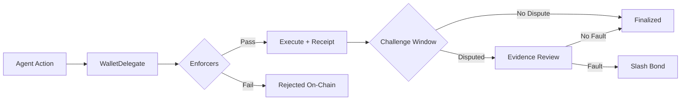
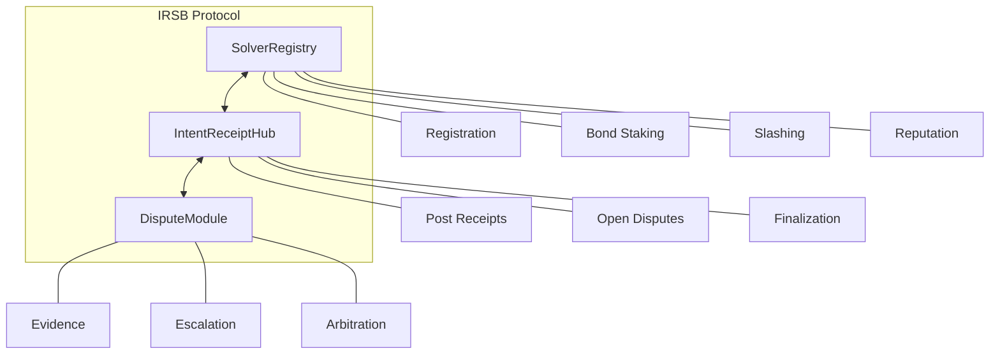
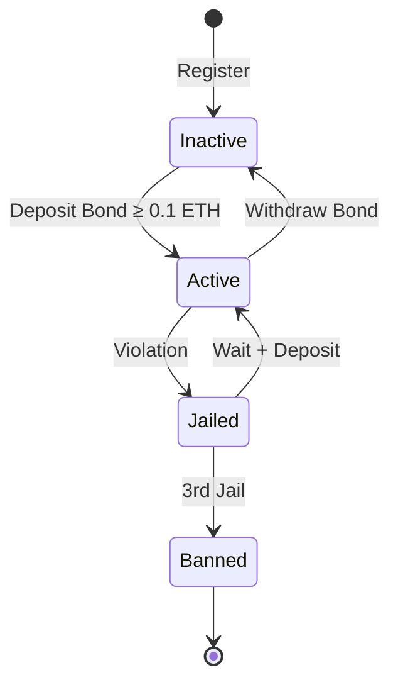
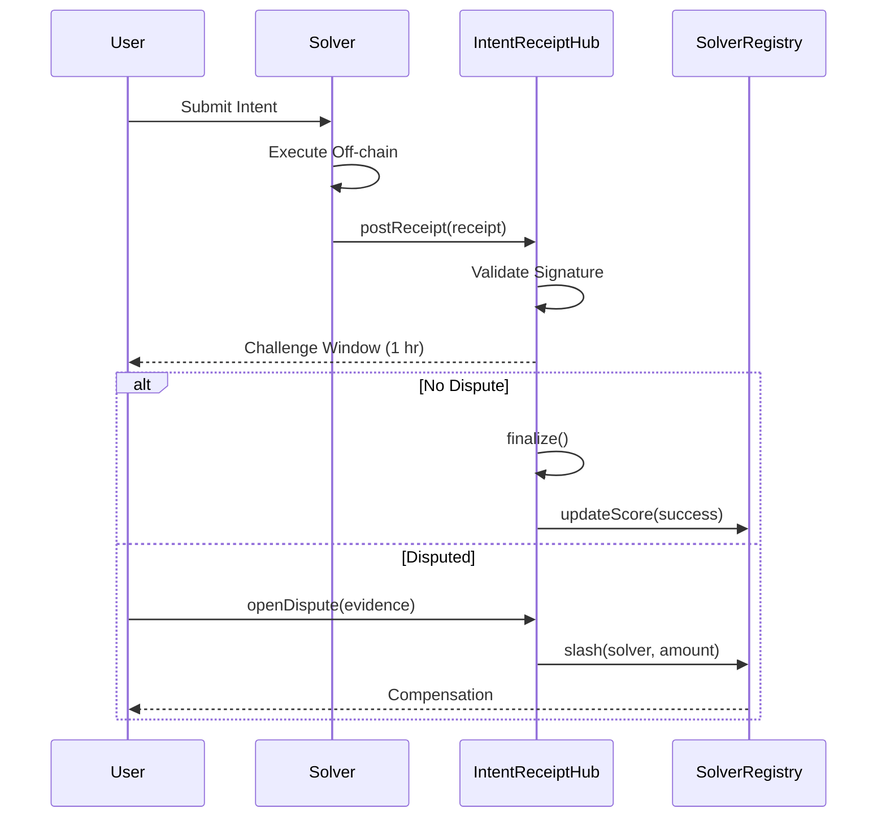

# IRSB Protocol

**On-chain guardrails for AI agents and intent-based transactions.**

> Your AI agent has wallet access. IRSB ensures it stays within bounds.

---

## The Problem

AI agents are gaining wallet access through frameworks like AgentKit, ElizaOS, and Olas — but there are no on-chain mechanisms to enforce spending limits, prove what agents did, or provide recourse when they act outside their mandate. The same gap exists for DeFi solvers executing user intents.

**"What happens when the agent overspends, calls the wrong contract, or goes rogue?"**

Today: Nothing. No spend limits. No audit trail. No recourse.

## The Solution

IRSB provides on-chain policy enforcement, cryptographic receipts, and automated dispute resolution:

| Component | What It Does |
|-----------|--------------|
| **WalletDelegate + Enforcers** | On-chain spending limits, time windows, contract/method whitelists via EIP-7702 |
| **Receipts** | Cryptographic proof of every on-chain action |
| **Bonds** | Staked collateral slashable for violations |
| **Disputes** | Automated enforcement with watchtower monitoring |
| **Reputation** | Portable trust scores via ERC-8004 registry |

### Caveat Enforcers

Five on-chain enforcers validate every delegated transaction before execution:

| Enforcer | Purpose |
|----------|---------|
| **SpendLimitEnforcer** | Daily and per-transaction spending caps |
| **TimeWindowEnforcer** | Restrict agent signing to defined time windows |
| **AllowedTargetsEnforcer** | Whitelist of approved contract addresses |
| **AllowedMethodsEnforcer** | Whitelist of approved function selectors |
| **NonceEnforcer** | Replay prevention for each delegated action |



## Why IRSB?

- **On-chain policy enforcement** — Spend limits, time windows, and contract whitelists enforced at the EVM level
- **Verifiable execution** — Every action produces a cryptographic receipt
- **Framework-agnostic** — Works with any agent or solver that holds wallet keys
- **ERC-7683 compatible** — Native support for the cross-chain intent standard
- **Portable reputation** — Agent track records move across protocols via ERC-8004

## How IRSB Connects to Other Standards

```mermaid
flowchart TB
    subgraph Standards
        EIP7702[EIP-7702<br/>Account Delegation]
        ERC7683[ERC-7683<br/>Intent Format]
        ERC8004[ERC-8004<br/>Agent Registry]
        X402[x402<br/>HTTP Payments]
    end

    subgraph IRSB[IRSB Protocol]
        Core[Enforcers + Receipts + Bonds + Disputes]
    end

    EIP7702 -->|"delegate to WalletDelegate"| Core
    ERC7683 -->|"intentHash"| Core
    Core -->|"validation signals"| ERC8004
    X402 -->|"payment proof"| Core
    Core -->|"service accountability"| X402

    style IRSB fill:#1a1a2e,stroke:#16213e
    style Core fill:#0f3460,stroke:#e94560,color:#fff
```



| Standard | What It Does | How IRSB Connects |
|----------|--------------|-------------------|
| **EIP-7702** | EOA delegates execution to contract code | Agents delegate to WalletDelegate for policy-enforced transactions |
| **ERC-7683** | Defines intent format | IRSB receipts reference `intentHash` from ERC-7683 orders |
| **ERC-8004** | Agent identity & reputation registry | IRSB is a **Validation Provider** — generates signals that feed the registry |
| **x402** | HTTP 402 payment protocol | IRSB adds accountability to paid APIs — receipts prove service delivery |

### IRSB + ERC-8004: Reputation from Execution

ERC-8004 stores agent identities and reputation scores. IRSB generates the validation signals that update those scores based on actual on-chain execution.

```
Agent executes action through WalletDelegate
    → Enforcers validate caveats
    → IRSB receipt posted
    → Challenge window passes
    → finalize() called
    → ERC8004Adapter.signalFinalized()
    → Agent reputation updated in ERC-8004 registry
```

### IRSB + x402: Accountability for Paid APIs

When AI agents pay for services via x402, IRSB ensures accountability:

```
Agent sends x402 payment → Service executes → IRSB receipt posted
                                                    ↓
                                            Dispute? → Slash bond
                                            No dispute? → Reputation++
```

The `irsb-x402` package handles this flow.

## Quick Start

```bash
# Install
forge install

# Build
forge build

# Test (448 tests)
forge test
```

## Deployments

### Sepolia Testnet

| Contract | Address |
|----------|---------|
| SolverRegistry | `0xB6ab964832808E49635fF82D1996D6a888ecB745` |
| IntentReceiptHub | `0xD66A1e880AA3939CA066a9EA1dD37ad3d01D977c` |
| DisputeModule | `0x144DfEcB57B08471e2A75E78fc0d2A74A89DB79D` |

## Architecture



## Solver Lifecycle



## Receipt Flow



## Key Parameters

| Parameter | Value | Purpose |
|-----------|-------|---------|
| Minimum Bond | 0.1 ETH | Solver activation threshold |
| Challenge Window | 1 hour | Time to dispute a receipt |
| Withdrawal Cooldown | 7 days | Delay before withdrawing bond |
| Max Jails | 3 | Strikes before permanent ban |

## Documentation

| Document | Description |
|----------|-------------|
| [CHANGELOG](./CHANGELOG.md) | Release history |
| [000-docs/](./000-docs/) | Architecture decisions, specs, guides |
| [x402 Integration](./000-docs/016-AT-INTG-x402-integration.md) | HTTP 402 payment integration |
| [Privacy Design](./000-docs/014-AT-DSGN-privacy-design.md) | On-chain vs off-chain data model |

## Packages

| Package | Description |
|---------|-------------|
| `packages/x402-irsb` | x402 HTTP payment integration |
| `examples/x402-express-service` | Express example with 402 flow |

## Development

```bash
# Run all tests
forge test

# Run specific test file
forge test --match-path test/SolverRegistry.t.sol -vvv

# Gas report
forge test --gas-report

# Coverage report
forge coverage --report summary --ir-minimum

# Deploy locally
anvil &
forge script script/Deploy.s.sol:DeployLocal --fork-url http://localhost:8545 --broadcast
```

### Security Testing

```bash
# Run with CI-equivalent fuzz iterations (10,000 runs)
FOUNDRY_PROFILE=ci forge test

# Or set fuzz runs directly
FOUNDRY_FUZZ_RUNS=10000 forge test

# Run invariant tests
forge test --match-path "test/invariants/*.sol"

# Static analysis with Slither
slither . --config-file slither.config.json

# Full security check
./scripts/security.sh
```

## Contributing

IRSB aims to be the standard on-chain guardrail layer for AI agents and intent-based transactions. Contributions welcome:

1. Open an issue to discuss changes
2. Fork and create a feature branch
3. Submit a PR with tests

## License

MIT - See [LICENSE](./LICENSE)

---

**IRSB v1.3.0** | [ERC-7683](https://eips.ethereum.org/EIPS/eip-7683) | [Foundry](https://book.getfoundry.sh/)
